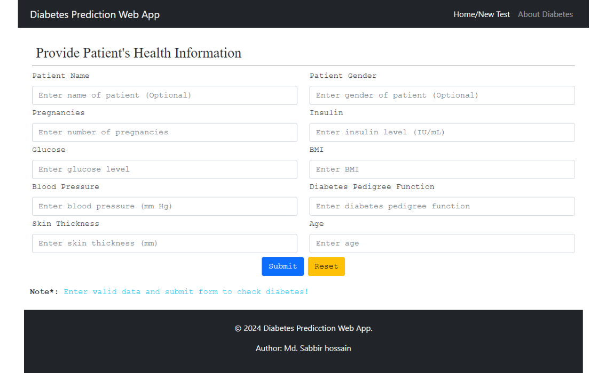
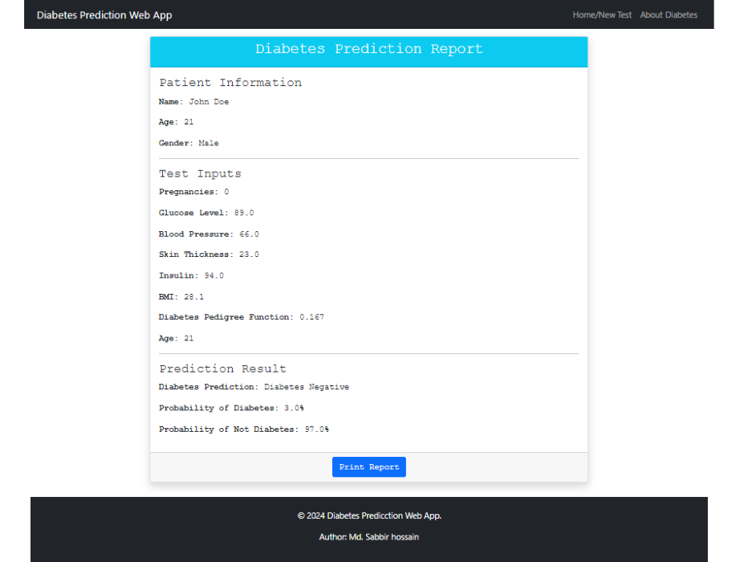
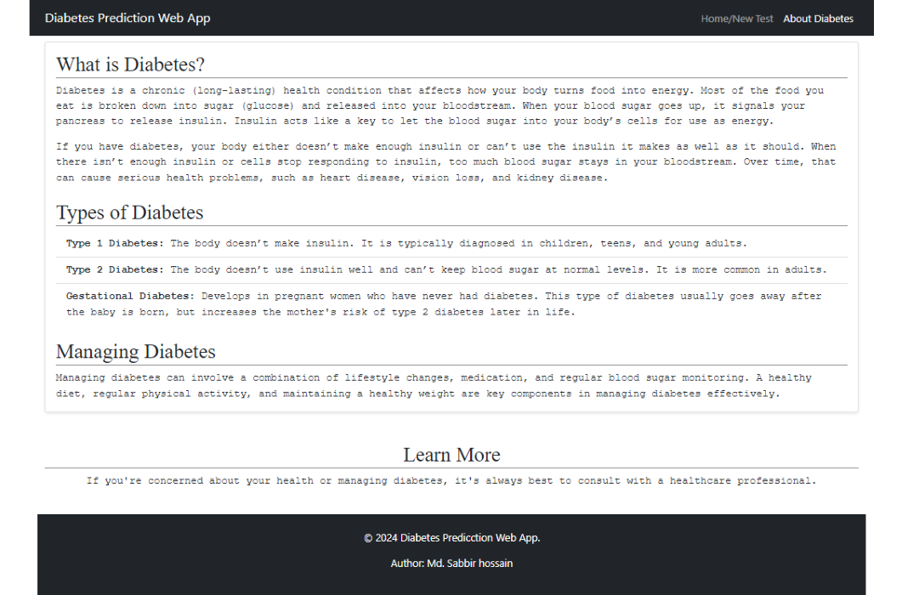

# Diabetes Prediction Web Application With FastAPI
 This is a machine learning-based web application for predicting diabetes in patients using Random Forest Classification. The application is built using FastAPI for the backend and Bootstrap 5 for the frontend. The app takes patient input data such as glucose level, blood pressure, BMI, etc., and predicts the probability of diabetes based on a trained machine learning model.

Author: Md. Sabbir Hossain
Date: 02/10/2024
Dataset: Diabetes Dataset
link: https://www.kaggle.com/datasets/mathchi/diabetes-data-set?resource=download

 ## Table of Contents
 - Features
 - Tech Stack
 - Setup Instructions
 - Usage
 - Screenshots

## Features
 - FastAPI Backend: A high-performance API backend for handling predictions.
 - Bootstrap 5 Frontend: A clean and responsive UI for user input.
 - Diabetes Prediction: Based on a trained Random Forest Classifier model.
 - Prediction Probability: Shows the likelihood of diabetes based on the provided patient data.
 - Printable Reports: Generate and print a detailed report of the prediction.

## Tech Stack
 - Backend: FastAPI
 - Frontend: HTML, Bootstrap 5
 - Machine Learning: Random Forest Classifier (trained model)

## Setup Instructions
To run this project locally, follow these steps:
1. Clone the repository:
   ```
   git clone https://github.com/Sabbir1039/Diabetes-Prediction-Web-Application-FastAPI.git
   cd diabetes-prediction-webapp
   ```
2. Create a virtual environment:
   ```
   python3 -m venv venv
   venv\Scripts\activate #Windows 
   source venv/bin/activate #mac

   ```
3. Install dependencies:
   ```
   pip install -r requirements.txt
   ```
4. Run the app:
   ```
   fastapi dev main.py
   ```
5. Open browser: Visit http://127.0.0.1:8000 to access the app.
   
## Usage
 - Enter patient details such as glucose level, blood pressure, BMI, etc.
 - Click on the "Submit" button to get the result.
 - The app will display whether the patient is likely to be diabetic along with the prediction probability.
 - Print the result page by clicking the "Print" button.
  
## Screenshots
### Homepage/New Test Page


### Prediction Result/ Report Page


### About Diabetes Page
